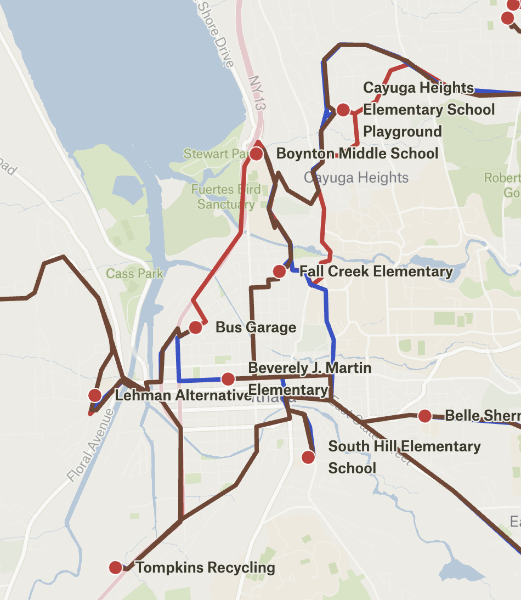

# Asphalt - Smarter Routes, Greener Future



**Asphalt** is a comprehensive route optimization platform designed to make transportation smarter and more eco-friendly. By leveraging spatial data and advanced algorithms, Asphalt helps users visualize infrastructure, analyze bottlenecks, and plan the most efficient paths to minimize fuel consumption and emissions.

## Features

- **Interactive Map Visualization**: Explore transportation networks with detailed map views using Leaflet and Google Maps.
- **Route Optimization**: Intelligent routing algorithms (TSP) to reorder stops for maximum efficiency.
- **Eco-Friendly Analysis**: Calculate potential fuel savings and emission reductions.
- **Data-Driven Insights**: Identify traffic bottlenecks and alternative routes.
- **Responsive Design**: A modern, responsive user interface built with Next.js and Tailwind CSS.

## Tech Stack

### Frontend
- **Framework**: [Next.js 15](https://nextjs.org/) (React 19)
- **Language**: TypeScript
- **Styling**: [Tailwind CSS](https://tailwindcss.com/)
- **Maps**: [Leaflet](https://leafletjs.com/), [React Leaflet](https://react-leaflet.js.org/), Google Maps API
- **Icons**: Lucide React, React Icons
- **Charts**: Recharts

### Backend
- **Framework**: [Flask](https://flask.palletsprojects.com/) (Python)
- **Optimization**: [Google OR-Tools](https://developers.google.com/optimization)
- **Routing Engine**: [OSRM](http://project-osrm.org/) (Open Source Routing Machine)
- **Server**: Gunicorn

### Deployment
- **Platform**: [Render](https://render.com/)
- **Configuration**: Infrastructure as Code via `render.yaml`

## Prerequisites

Before you begin, ensure you have the following installed:
- [Node.js](https://nodejs.org/) (v18 or higher)
- [Python](https://www.python.org/) (v3.8 or higher)
- [pip](https://pip.pypa.io/en/stable/)

## Getting Started

### 1. Clone the Repository

```bash
git clone https://github.com/yourusername/asphalt.git
cd asphalt
```

### 2. Backend Setup

The backend handles route optimization logic.

```bash
cd backend/app

# Create a virtual environment (optional but recommended)
python -m venv venv
source venv/bin/activate  # On Windows: venv\Scripts\activate

# Install dependencies
pip install -r requirements.txt

# Run the server
python app.py
```
The backend will start on `http://localhost:8000` (or the port defined in `config.py`).

### 3. Frontend Setup

The frontend provides the user interface.

```bash
# Open a new terminal window
cd frontend

# Install dependencies
npm install

# Run the development server
npm run dev
```
Open [http://localhost:3000](http://localhost:3000) with your browser to see the result.

## Configuration

### Environment Variables

**Backend (`backend/app/config.py` or env vars):**
- `FLASK_PORT`: Port to run the Flask server (default: `8000`).
- `OSRM_HOST`: URL of the OSRM instance (default: `http://100.30.34.94:5000`).

**Frontend:**
- Create a `.env.local` file in the `frontend` directory if you need to override default API URLs or add keys (e.g., Google Maps API key).

## Documentation

- [API Documentation](docs/API.md): Detailed reference for the backend API endpoints.
- [Architecture Overview](docs/ARCHITECTURE.md): High-level explanation of how the system components fit together.
- [Testing Guide](docs/TESTING.md): Instructions for running unit tests and load tests.

## Deployment

This project is configured for deployment on **Render**. The `render.yaml` file in the root directory defines the services:

1.  **Web Service (Backend)**: Python/Flask app running with Gunicorn.
2.  **Web Service (Frontend)**: (Configuration typically added here or deployed as a Static Site/Node app).
